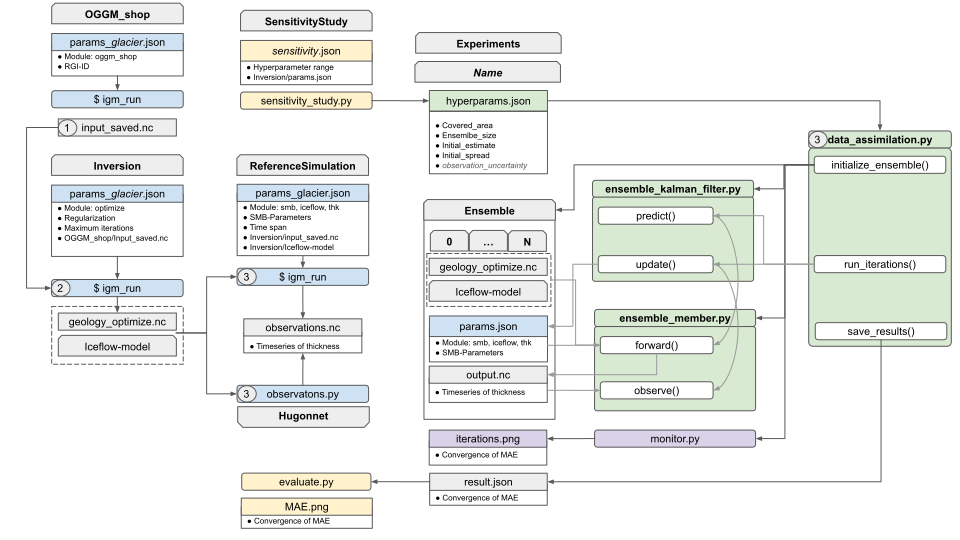
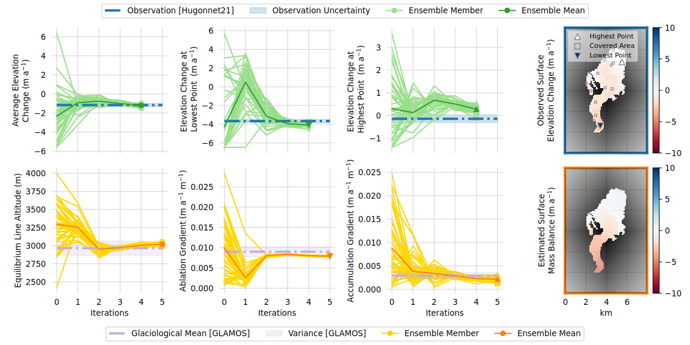
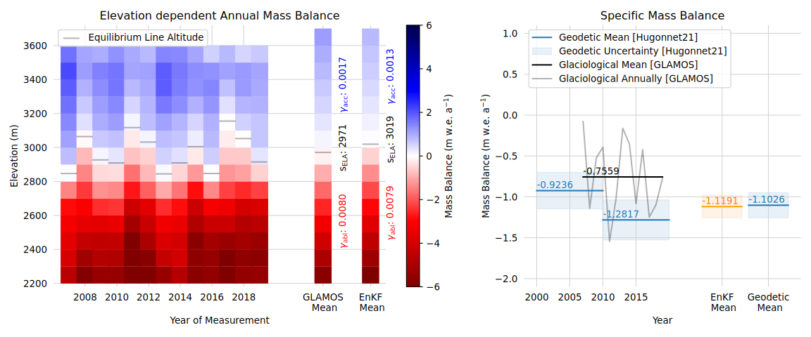

# DataAssimilation

This repository contains the code for a data assimilation strategy coupling the Ensebmle Kalman Filter with the Instructed glacier model [Instructed Glacier Model (IGM)]([URL](https://github.com/jouvetg/igm)).
1. The OGGM-shop module of IGM is used to download glacier related maps. 
2. The inversion module of IGM is used to optimize thicknes and slinding coefficient. 
3. Observations are generated ether using IGM or from the elevation change map of Hugonnet et al.
4. Our data assimilation script uses the Ensembel Kalman filter to infer Surface Mass Balance Parameters of the simple SMB module from IGM.

